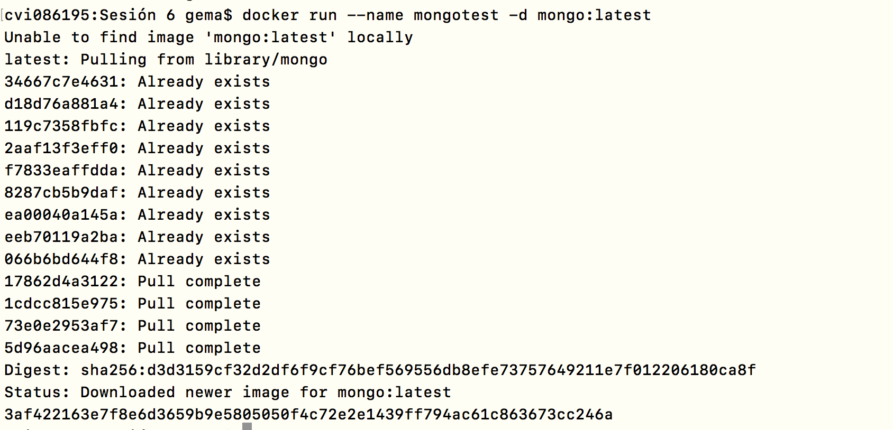
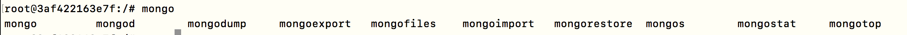
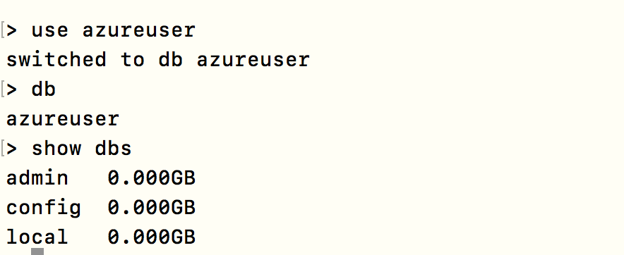
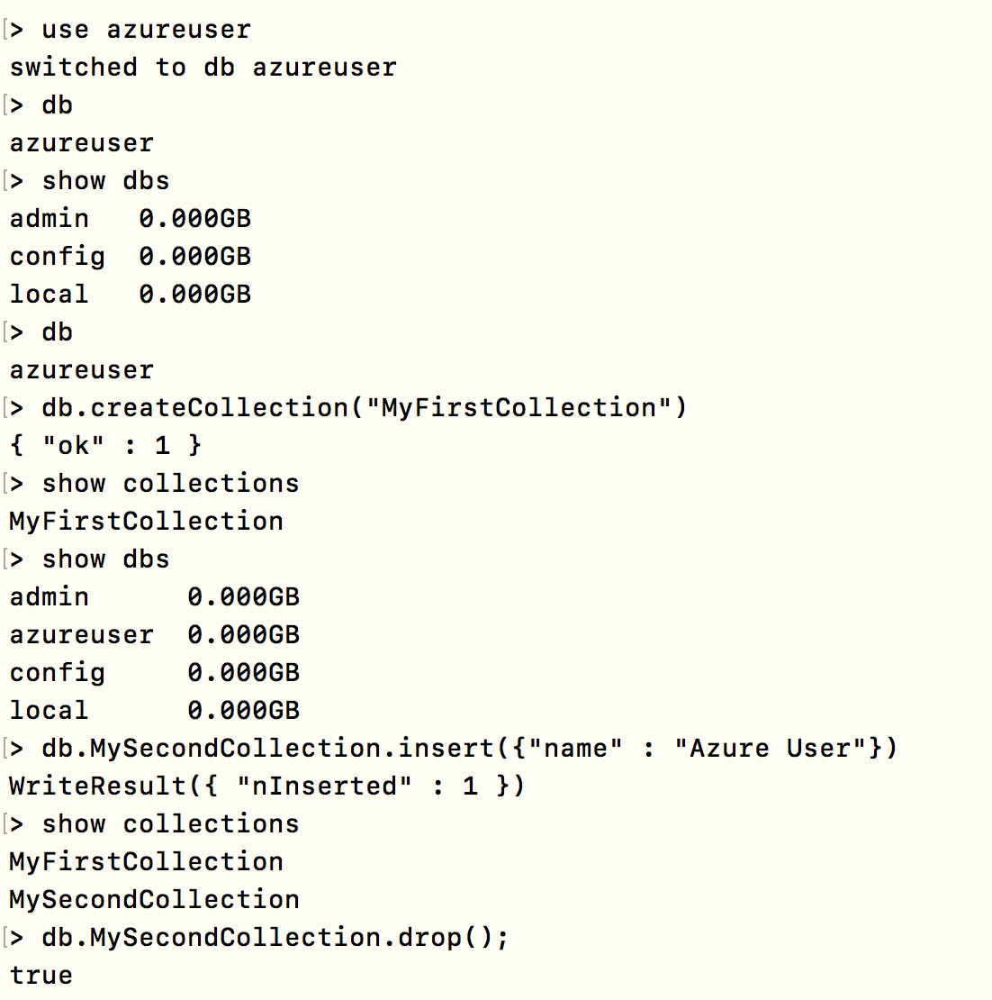
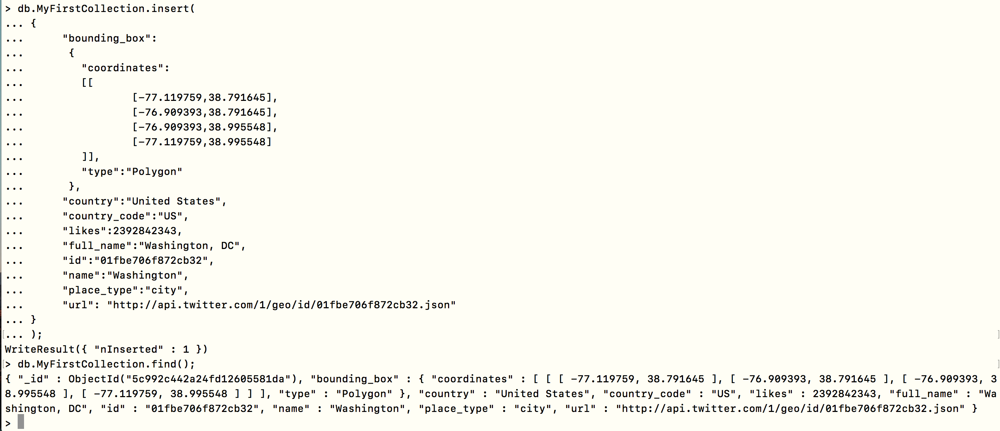
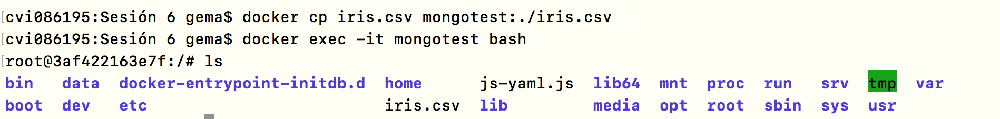
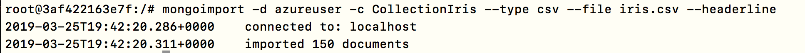
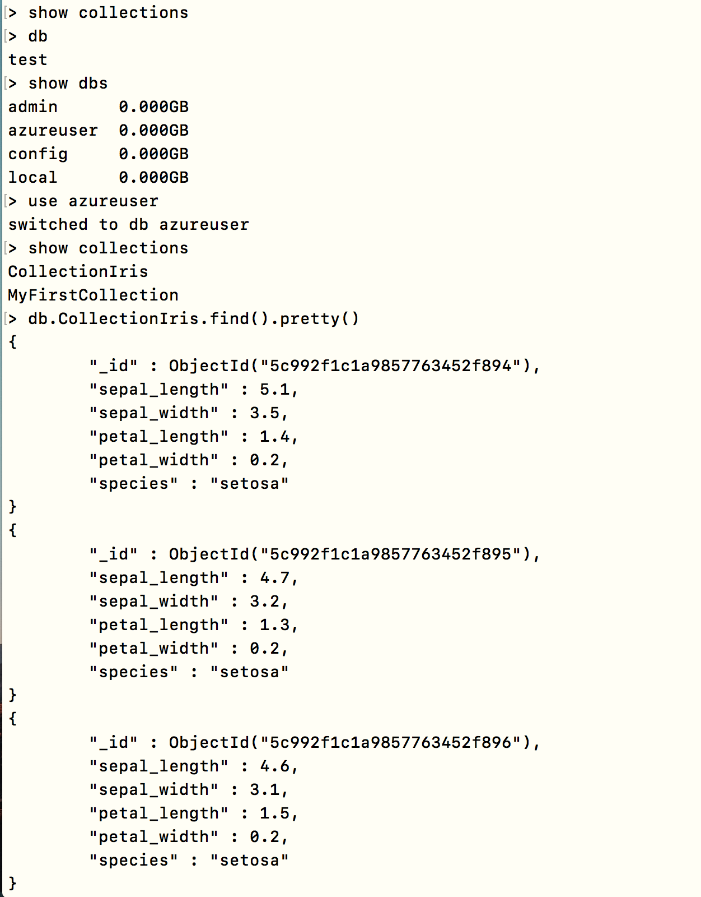
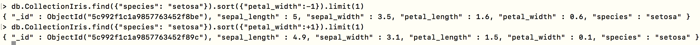

# Sesión 6

**Comenzando con MongoDB**

Instalamos mongoDB desde Docker creando nuestro propio servidor:

~~~
$ docker run --name mongotest -d mongo:latest
~~~

Entramos a la shell de nuestro contenedor:

~~~
$ docker exec -it mongotest bash
~~~

mongo         mongod        mongodump     mongoexport   mongofiles    mongoimport   mongorestore  mongos        mongostat     mongotop  

Conectando a mongodb:

~~~
$ mongo
~~~

Conectará con los parámetros por defecto: localhost, puerto: 27017 y base de datos: test.

> use azureuser
switched to db azureuser

> db
azureuser

> show dbs --> no sale nada
admin   0.000GB
config  0.000GB
local   0.000GB

**Crear una colección**

> db.createCollection(name, options)

Y luego creamos la colección:
> db.createCollection("MyFirstCollection")
{ "ok" : 1 }

Ahora comprobamos que está disponible:

Mostramos la colección
> show collections
MyFirstCollection

Ya está creada la BD, aunque nos metamos nada y esté vacía
> show dbs
admin      0.000GB
azureuser  0.000GB
config     0.000GB
local      0.000GB

En MongoDB, no es necesario crear la colección. MongoDB crea la colección automáticamente, cuando usted inserte algún documento:

> db.MySecondCollection.insert({"name" : "Azure User"})
WriteResult({ "nInserted" : 1 })

Ya tienes las nuevas colecciones creadas:

> show collections
MyFirstCollection
MySecondCollection

**Borrar las colecciones**

> db.MySecondCollection.drop();
true

**Trabajar con documentos sobre las colecciones**

Para insertar datos en la colección de MongoDB, necesita usar el método insert() o save() de MongoDB.

~~~
db.MyFirstCollection.insert(
{    
     "bounding_box":
      {
        "coordinates":
        [[
                [-77.119759,38.791645],
                [-76.909393,38.791645],
                [-76.909393,38.995548],
                [-77.119759,38.995548]
        ]],
        "type":"Polygon"
      },
     "country":"United States",
     "country_code":"US",
     "likes":2392842343,
     "full_name":"Washington, DC",
     "id":"01fbe706f872cb32",
     "name":"Washington",
     "place_type":"city",
     "url": "http://api.twitter.com/1/geo/id/01fbe706f872cb32.json"
}
);
~~~

WriteResult({ "nInserted" : 1 })

Comprobar si el documento está almacenado:

~~~
> db.MyFirstCollection.find();

{ "_id" : ObjectId("5c992c442a24fd12605581da"), "bounding_box" : { "coordinates" : [ [ [ -77.119759, 38.791645 ], [ -76.909393, 38.791645 ], [ -76.909393, 38.995548 ], [ -77.119759, 38.995548 ] ] ], "type" : "Polygon" }, "country" : "United States", "country_code" : "US", "likes" : 2392842343, "full_name" : "Washington, DC", "id" : "01fbe706f872cb32", "name" : "Washington", "place_type" : "city", "url" : "http://api.twitter.com/1/geo/id/01fbe706f872cb32.json" }
~~~

Añade multiples documentos:

~~~
var places= [
  {    
     "bounding_box":
      {
        "coordinates":
        [[
                [-77.119759,38.791645],
                [-76.909393,38.791645],
                [-76.909393,38.995548],
                [-77.119759,38.995548]
        ]],
        "type":"Polygon"
      },
     "country":"United States",
     "country_code":"US",
     "likes":2392842343,
     "full_name":"Washington, DC",
     "id":"01fbe706f872cb32",
     "name":"Washington",
     "place_type":"city",
     "url": "http://api.twitter.com/1/geo/id/01fbe706f872cb32.json"
},
{    
     "bounding_box":
      {
        "coordinates":
        [[
                [-7.119759,33.791645],
                [-7.909393,34.791645],
                [-7.909393,32.995548],
                [-7.119759,34.995548]
        ]],
        "type":"Polygon"
      },
     "country":"Spain",
     "country_code":"US",
     "likes":2334244,
     "full_name":"Madrid",
     "id":"01fbe706f872cb32",
     "name":"Madrid",
     "place_type":"city",
     "url": "http://api.twitter.com/1/geo/id/01fbe706f87333e.json"
}
]
~~~

> db.MyFirstCollection.insert(places)
BulkWriteResult({
	"writeErrors" : [ ],
	"writeConcernErrors" : [ ],
	"nInserted" : 2,
	"nUpserted" : 0,
	"nMatched" : 0,
	"nModified" : 0,
	"nRemoved" : 0,
	"upserted" : [ ]
})

Dos métodos para guardar/insertar:

> db.MyFirstCollection.save({username:"myuser",password:"mypasswd"})
> db.MyFirstCollection.insert({username:"myuser",password:"mypasswd"})

Si un documento no existe con el valor _id_ especificado, el método _save()_ realiza una inserción con los campos especificados en el documento.
Si existe un documento con el valor _id_ especificado, el método _save()_ realiza una actualización, sustituyendo todos los campos del registro existente por los campos del documento.

El insert siempre crea un documento nuevo o entrada, solo para insertar, y el save te lo actualiza sino sirve y sino te crea una instancia nueva.

**Seleccionando, Consultando y Filtrando**

Cuenta los documentos, añade .count() al comando:

ahora hacemos un count y tenemos que tener 3 creados:

> db.MyFirstCollection.count()
3

> db.MyFirstCollection.find().count()
3

Muestra todos los documentos en MyFirstCollection:

~~~
> db.MyFirstCollection.find();
{ "_id" : ObjectId("5c992c442a24fd12605581da"), "bounding_box" : { "coordinates" : [ [ [ -77.119759, 38.791645 ], [ -76.909393, 38.791645 ], [ -76.909393, 38.995548 ], [ -77.119759, 38.995548 ] ] ], "type" : "Polygon" }, "country" : "United States", "country_code" : "US", "likes" : 2392842343, "full_name" : "Washington, DC", "id" : "01fbe706f872cb32", "name" : "Washington", "place_type" : "city", "url" : "http://api.twitter.com/1/geo/id/01fbe706f872cb32.json" }
{ "_id" : ObjectId("5c992cec2a24fd12605581db"), "bounding_box" : { "coordinates" : [ [ [ -77.119759, 38.791645 ], [ -76.909393, 38.791645 ], [ -76.909393, 38.995548 ], [ -77.119759, 38.995548 ] ] ], "type" : "Polygon" }, "country" : "United States", "country_code" : "US", "likes" : 2392842343, "full_name" : "Washington, DC", "id" : "01fbe706f872cb32", "name" : "Washington", "place_type" : "city", "url" : "http://api.twitter.com/1/geo/id/01fbe706f872cb32.json" }
{ "_id" : ObjectId("5c992cec2a24fd12605581dc"), "bounding_box" : { "coordinates" : [ [ [ -7.119759, 33.791645 ], [ -7.909393, 34.791645 ], [ -7.909393, 32.995548 ], [ -7.119759, 34.995548 ] ] ], "type" : "Polygon" }, "country" : "Spain", "country_code" : "US", "likes" : 2334244, "full_name" : "Madrid", "id" : "01fbe706f872cb32", "name" : "Madrid", "place_type" : "city", "url" : "http://api.twitter.com/1/geo/id/01fbe706f87333e.json" }
~~~

Sólo un documento:

> db.MyFirstCollection.findOne();

Muestra los documentos en un formato bonito:

> db.MyFirstCollection.find().pretty()

Selecciona o busca mediante campos, por ejemplo como bounding_box.type:

# Importar datos externos

Te sales de la máquina de docker, y en tu HOME te descargas

wget https://raw.githubusercontent.com/uiuc-cse/data-fa14/gh-pages/data/iris.csv

Para importar el fichero:

Primero ha de importarse el fichero al contenedor:

docker cp iris.csv mongotest:./iris.csv

Entramos en el contenedor:

docker exec -it mongotest bash

E importamos el fichero

mongoimport -d azureuser -c CollectionIris --type csv --file iris.csv --headerline

2019-03-25T19:42:20.286+0000	connected to: localhost
2019-03-25T19:42:20.311+0000	imported 150 documents

> show collections
> db
test
> show dbs
admin      0.000GB
azureuser  0.000GB
config     0.000GB
local      0.000GB
> use azureuser
switched to db azureuser
> show collections
CollectionIris
MyFirstCollection
> db.CollectionIris.find().pretty()

Ver el numero de clases que tiene:

Cuenta el número de clases diferentes.
> db.CollectionIris.distinct("species",{})
[ "setosa", "versicolor", "virginica" ]

> db.CollectionIris.distinct("species",{}).length
3

https://stackoverflow.com/questions/14924495/mongodb-count-num-of-distinct-values-per-field-key

Encuentra el máximo y minimo valor por columna para cada clase.

Te ordena de mayor a menor, porque de normal coge el orden de menor a mayor, así que con el "-1" estamos mostrando el mayor y cogemos el primero.
> db.CollectionIris.find({"species": "setosa"}).sort({"petal_width":-1}).limit(1)
{ "_id" : ObjectId("5c992f1c1a9857763452f8be"), "sepal_length" : 5, "sepal_width" : 3.5, "petal_length" : 1.6, "petal_width" : 0.6, "species" : "setosa" }

Ordenamos de menor a mayor, y cogemos el minimo
> db.CollectionIris.find({"species": "setosa"}).sort({"petal_width":+1}).limit(1)
{ "_id" : ObjectId("5c992f1c1a9857763452f89c"), "sepal_length" : 4.9, "sepal_width" : 3.1, "petal_length" : 1.5, "petal_width" : 0.1, "species" : "setosa" }
